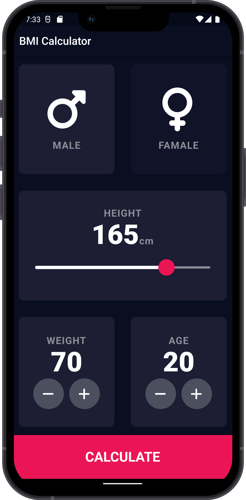
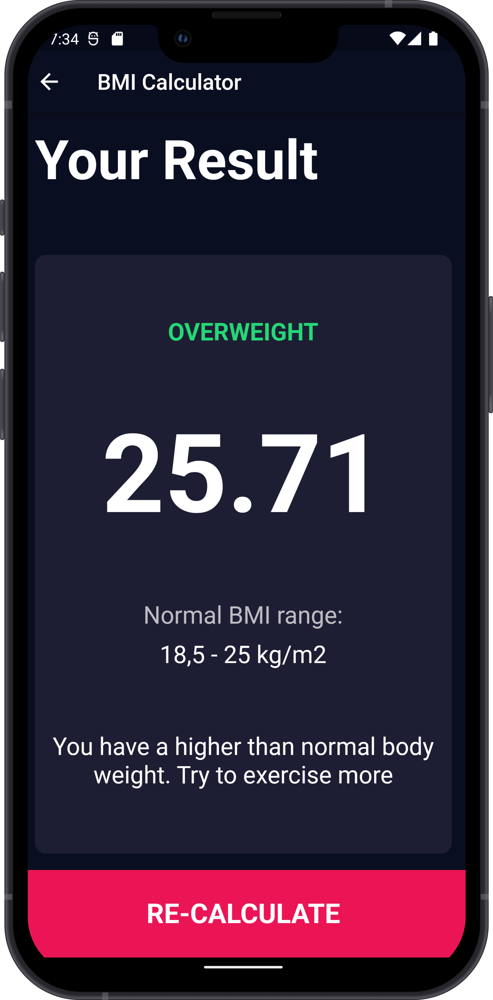

# Flutter Simple BMI Calculator

```dart
class Revaldo extends FlutterProject {
    return {
      "title": "Flutter Simple BMI Calculator",
      "description": "Slicing UI BMI calculator with added bit of functionality",
      "design": "https://dribbble.com/shots/4585382-Simple-BMI-Calculator"
    }
}
```

## Getting Started 🚀

```shell
- Clone the repo
- flutter pub get
- flutter run
```

## ScreenShot
&nbsp;